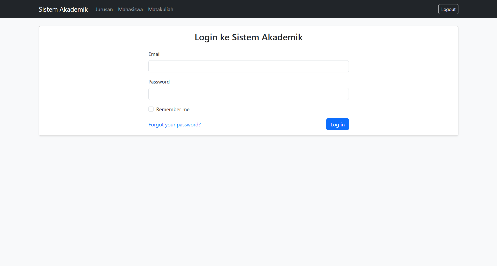
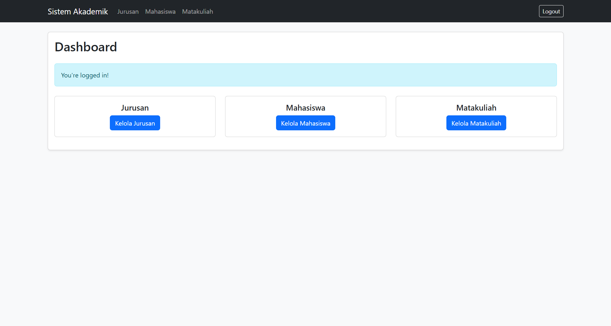
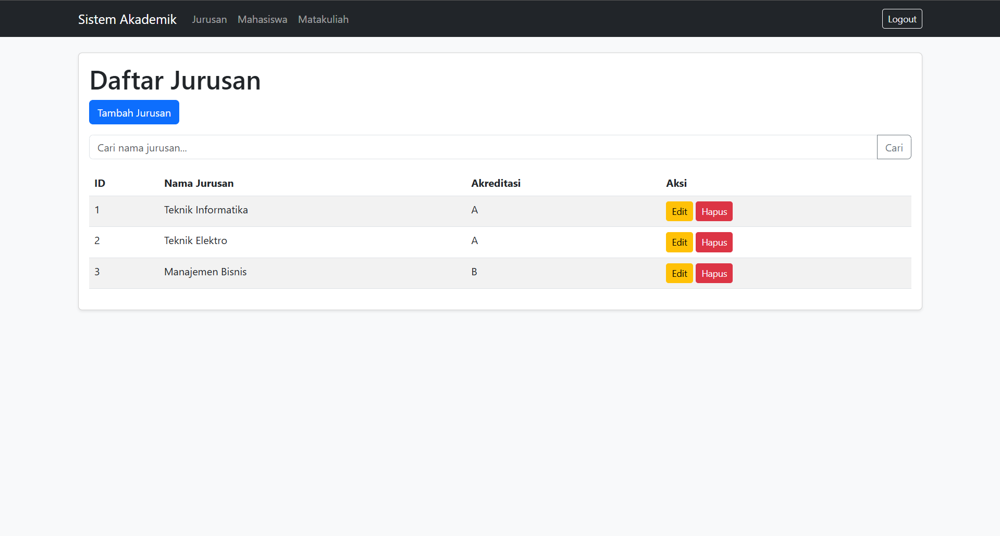
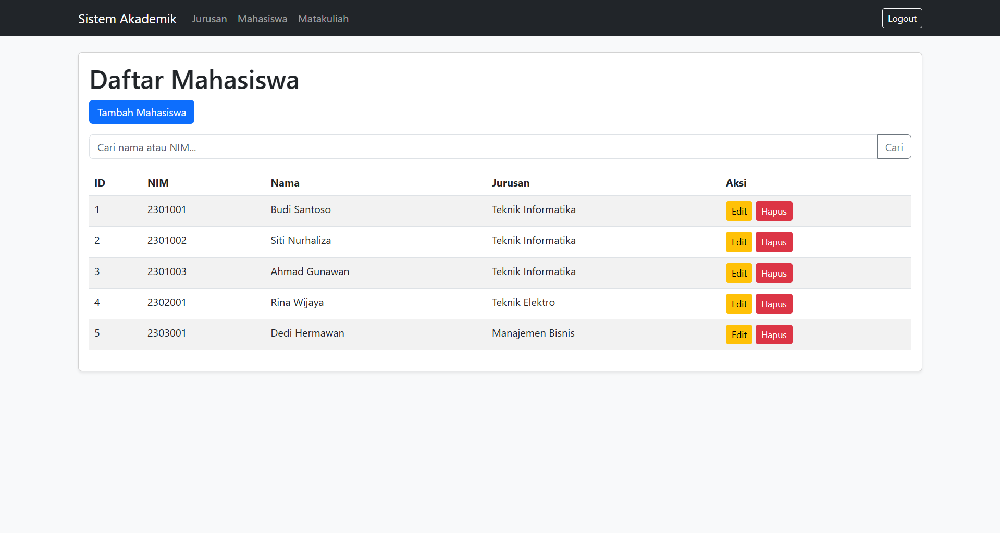
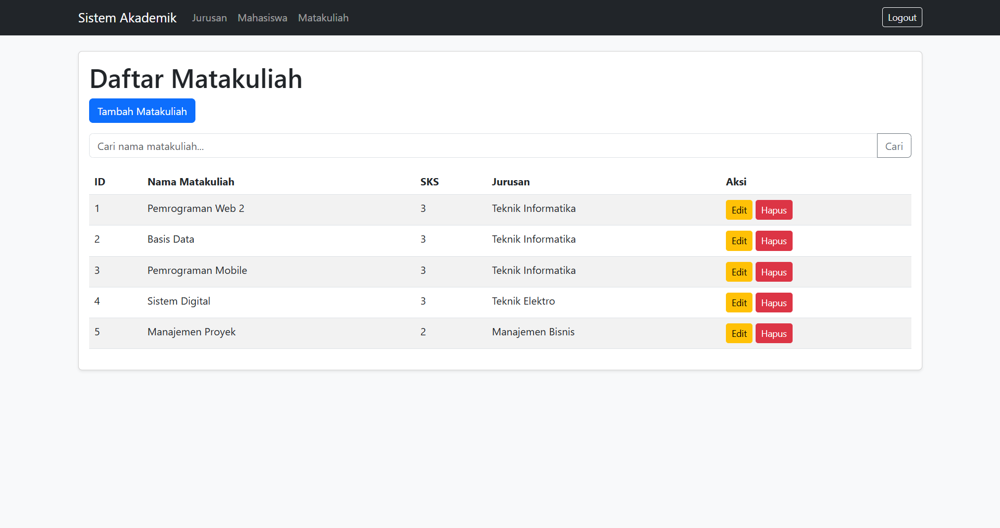

# LAPORAN UJIAN TENGAH SEMESTER

**UNIVERSITAS TEKNOLOGI BANDUNG**  
**DEPARTEMEN TEKNIK INFORMATIKA**

---

### Informasi Ujian
- **Mata Kuliah / SKS** : Pemrograman Web 2 / 3 SKS
- **Dosen**             : Ipan Saepul Milal, S.Kom.
- **Waktu / Sifat Ujian**: Take Home
- **Kelas**             : TIF RP 23 CNS A

### Data Mahasiswa
- **Nama** : [ISI NAMA ANDA DI SINI]
- **NIM**  : [ISI NIM ANDA DI SINI]

---

## 1. Link Github Source Code Project Laravel
[https://github.com/tech0608/UTS_Pemrograman_Web_2](https://github.com/tech0608/UTS_Pemrograman_Web_2)

## 2. Link Database (.sql)
[https://drive.google.com/drive/folders/1RFQpX3mnbJzYxy4CrsP5TzldNnFWTO28?usp=sharing](https://drive.google.com/drive/folders/1RFQpX3mnbJzYxy4CrsP5TzldNnFWTO28?usp=sharing)

## 3. Dokumentasi Screenshot

Berikut adalah dokumentasi hasil pengerjaan Sistem Akademik Sederhana berbasis Laravel 12 + MySQL:

### A. Halaman Login
*Menampilkan fitur login wajib menggunakan middleware auth.*  

### B. Dashboard
*Menampilkan dashboard setelah pengguna berhasil login, beserta navigasi ke masing-masing halaman CRUD.*  

### C. CRUD Jurusan
*Menampilkan fungsionalitas Tambah, Tampil, Edit, dan Hapus data Jurusan.*  

### D. CRUD Mahasiswa
*Menampilkan fungsionalitas CRUD data Mahasiswa lengkap dengan relasi ke tabel Jurusan (Belongs To).*  

### E. CRUD Matakuliah
*Menampilkan fungsionalitas CRUD data Matakuliah lengkap dengan relasi ke tabel Jurusan (Belongs To).*  

---

### *Keterangan Tambahan (Bonus yang dikerjakan):*
1. **Validasi Form**: Tersedia pada setiap input form create/edit.
2. **Seeder**: Tersedia data dummy untuk Jurusan, Mahasiswa, Matakuliah, dan User login.
3. **Pagination**: Menampilkan data dalam beberapa halaman.
4. **Search Data**: Fitur pencarian tersedia di setiap halaman index tabel.
5. **UI Bootstrap**: Tampilan menggunakan framework Bootstrap 5.
